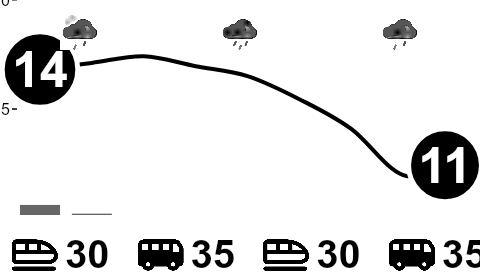
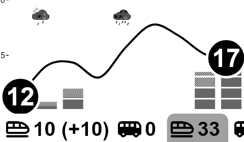

# node-epd-display

Draw something with ssr canvas (`@napi-rs/canvas`) and display it on an e-paper display with Waveshare's C drivers. WIP

This is configured to build the following weather and local transit chart, including rain and transit delays, should there be any, based on data from `yr` and `entur`, configured locally on a Raspberry Pi to refresh every 10 minutes, to always contain relevant data.

Sample output



Sample output with mock data, delays etc., big delays specify amt of minutes, small have shaded backgrounds to indicate something being up



This project is a (not yet complete) replacement for my [previous system](https://miniweather.vercel.app) which was based on https://github.com/samsonmking/epaper.js.

`epaper.js` is a poor idea to use for something like this, since it will download an entire copy of Chrome each time it creates an image, which will run for about a year on a fresh SD card, before the SD card wears out. Before that happens it will also probably start breaking randomly because the SD card will be full. Once it has broken, it will be hard to make work again because it is tied to the particular release of Google Chrome that happened to be current when the package was last updated 2 years ago.

This project instead of using the full selection of frontend web tech to render the chart, instead uses `@napi-rs/canvas` (https://github.com/Brooooooklyn/canvas) to render the graphic in memory, and send it directly to the Waveshare display without writing anything but error logs to disk.

For now this project is very tightly coupled to my specific use case, but it should be relatively straightforward to untangle.

## Usage

### Display a preview

```bash
npm i
npm run preview
```

### Display the image (on a Waveshare 3in7 Raspberry Pi hat display)

Depends on binaries from the Waveshare readme: https://www.waveshare.com/wiki/3.7inch_e-Paper_HAT_Manual#Working_With_Raspberry_Pi

```bash
npm run display
```

### Run regularly with `cron`
